# Migrate Source Apps to PAAS

## Overview

In this lab, you will learn how to migrate legacy applications to PaaS. You will learn how to:

* Migrate a database to Azure SQL PAAS using Azure SQL Migrate
* Create VS 2017 empty project
* Copy files from source apps
* Add to VSTS
* Create pipeline and deploy to the PAAS app service
* Update the connection string in the APP Settings of the app service

## Prerequisites

* VS 2017 Installed
* Source Apps available
* You have a VSTS Account
* You have an Azure Subscription
* You have an Azure SQL DB Deployed

## Exercises

---

This hands-on-lab has the following exercises:

1. [Exercise 1: Migrate Databases to Azure SQL](#ex1)
1. [Exercise 2: Create Visual Studio Solution and Import Source Apps](#ex2)
1. [Exercise 3: Create CI/CD Pipeline in VSTS](#ex3)

### Exercise 1: Migrate Databases to Azure SQL<a name="ex1"></a>

---

This lab is done from the jump box. Make sure you have cloned the repository as specified in [HOL 2](./HOL/02-configure-source-apps).

1. RDP into the jump box

1. Launch Internet Explorer

1. If this is the first time opening the browser on this machine, you may see the following:

    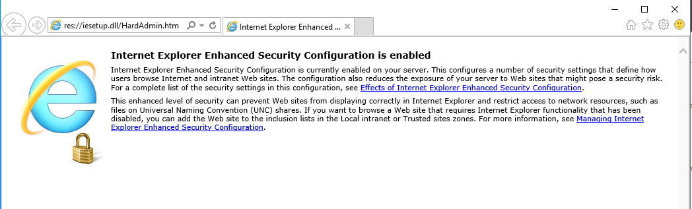

    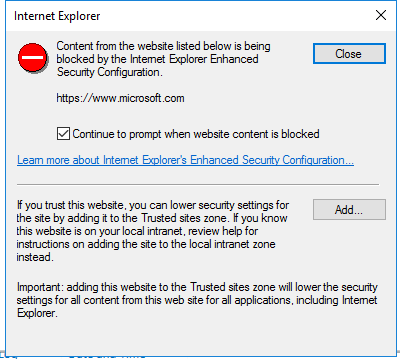

1. Disable the IE Enhanced Configuration setting by opening server manager

    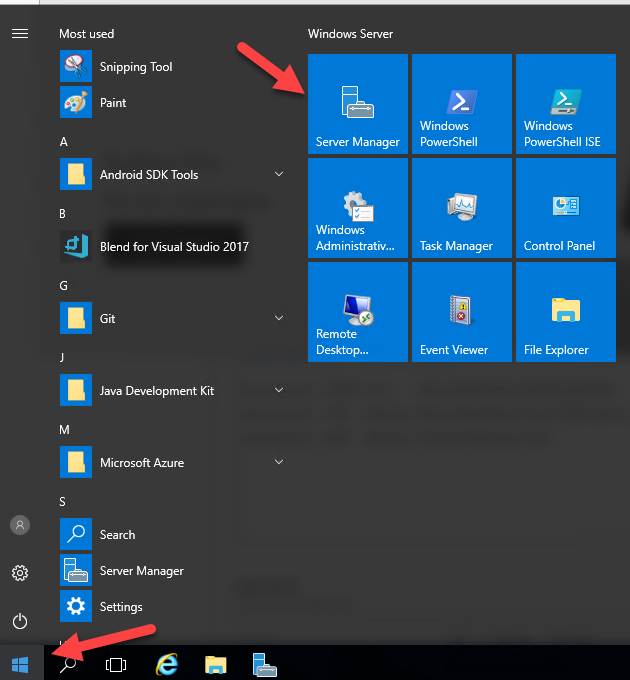

1. Locate the IE Enhanced Security Setting. Click the link

    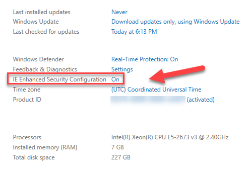

1. Select `Off`

    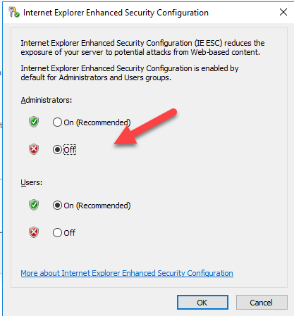

1. Navigate to [https://www.microsoft.com/en-us/download/details.aspx?id=53595](https://www.microsoft.com/en-us/download/details.aspx?id=53595) and download the Database Migration Assistant

1. When prompted, click `Run` to run the installer. Click `Next`

    

1. Select the `I accept ...` checkbox and click `Next > Install`

    

1. Select the `Launch Microsoft Data Migration Assistant` and click finish

    

1. Click on the + Migration and name the Project `JobsDB`. Click `Create`

    

1. Select the Source by entering your SQL server name `appm[YOUR UNIQUE NAME]-sql`. When prompted, select `Server Name > Windows Authentication` and Uncheck `Encrypt connection` and select the `JOBS` database

    

1. Navigate to the Azure Portal and find the name of your Azure SQL server Database. Click to view the properties

    

1. Find the Server name and copy it to the clipboard

    

1. Select `Target > Enter Authentication Credentials` and select the `JOBS` database in the Azure subscription and resource group you have deployed the template from HOL 1.

    

1. Select `SQL Server Authentication` and enter the user name and password

    > Username: appmigadmin
    >
    > Password: @pp_M!gr@ti0n-2018
    >

1. Select `objects`.  Make note of any blocking issues and non-blocking issues that will need to be addressed

1. Click `Generate SQL script`

   

1. To script & deploy the Schema, click `Deploy schema`

   

1. Once the schema has been deployed click `Migrate Data > Start data migration`

   

1. Wait for the migration to complete

   

### Exercise 2: Create a Visual Studio Solution and Import the Source Apps<a name="ex2"></a>

---

1. Make sure you have the Jobs Source Apps downloaded on your jump box. In this example they are located in the `C:\AppMigrationWorkshop\Shared\SourceApps\Apps\Jobs` folder

    

1. Open Visual Studio 2017. If this is the first time you are launching Visual Studio, you may be prompted to sign in. Use the same account you used for Visual Studio Online in HOL 1.

    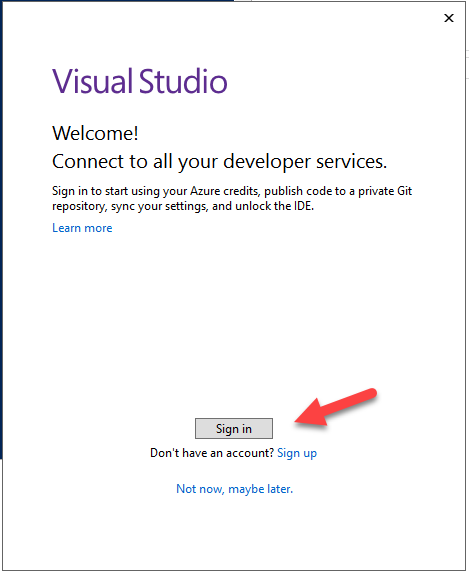

1. Select `File > New > Web Site` and choose `ASP.NET Empty Web Site` as the template.

    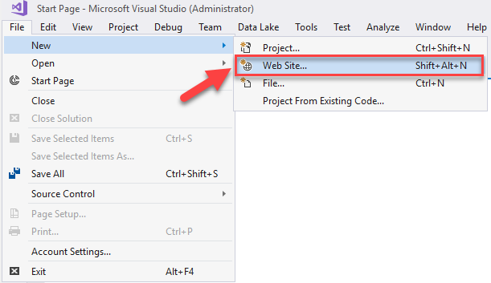

1. Select Browse and create a folder to contain the source applications. Create a folder for the JobsWebSite.

1. Name the project `JobsWebSite`.

    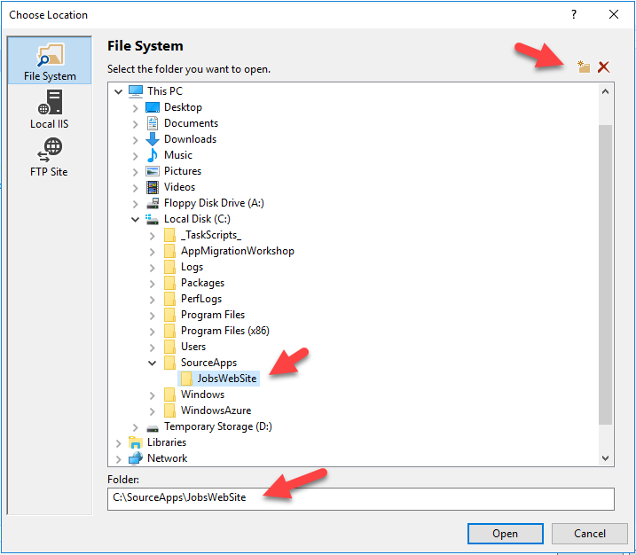

1. You should now have an empty web site solution as a target to copy the Jobs source files

1. Open Windows Explorer and navigate to the folder where you have stored the Jobs Source Files

1. Select all, click and drag the files to copy them into the new project

    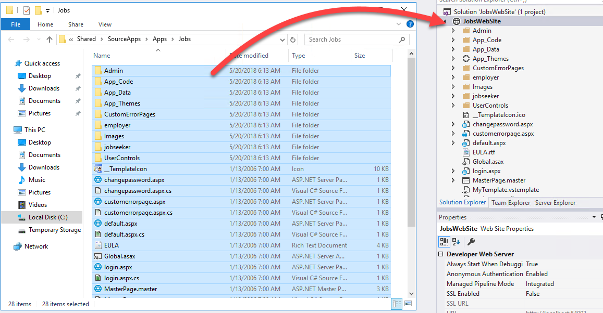

1. If prompted that files exist, select `Apply to all items` and `Yes`

    

1. Delete the `MyTemplate.vstemplate` and `ProjectName.webproj` files. These files were used with the older version of Visual Studio and are not longer needed.

    

1. You now have a Visual Studio 2017 Web Site project that we can publish to Azure

    

---

### Exercise 3: Create CI/CD Pipeline in VSTS<a name="ex3"></a>

1. Login to the cloud shell by navigating to [https://shell.azure.com](https://shell.azure.com)

1. Create a new Azure Web Application in a new resource group

    ````powershell
    $webapp = "[A UNIQUE NAME]" # this should be a unique name, for example jobswebsite[YOUR INITIALS][A NUMBER]
    $location = "[A VALID AZURE REGION]" #List Valid regions using  Get-AzureRmLocation | ft Location, DisplayName
    $rgName = "[YOUR RESOURCE GROUP NAME]"
    $subscription = "[YOUR SUBSCRIPTION ID]" # List using Get-AzureRMSubscription

    Login-AzureRmAccount
    Select-AzureRmSubscription -SubscriptionID $subscription
    #Create the resource group
    New-AzureRmResourceGroup -Name $rgName -Location $location
    #Create the app service plan
    New-AzureRmAppServicePlan -Name $webapp -Location $location -ResourceGroupName $rgName -Tier Free
    #Create an empty web app to deploy to
    New-AzureRmWebApp -Name $webapp -Location $location -AppServicePlan $webapp -ResourceGroupName $rgName
    ````

1. Open a browser and navigate to your VSTS Portal `(https://[YOUR VS  TENANT NAME].visualstudio.com/_projects)`

1. Click `Create New Project`

    

1. Name the project `JobsWebSite`. For the version control type, choose `Git`. For the `Work item process` choose `Agile`

    

    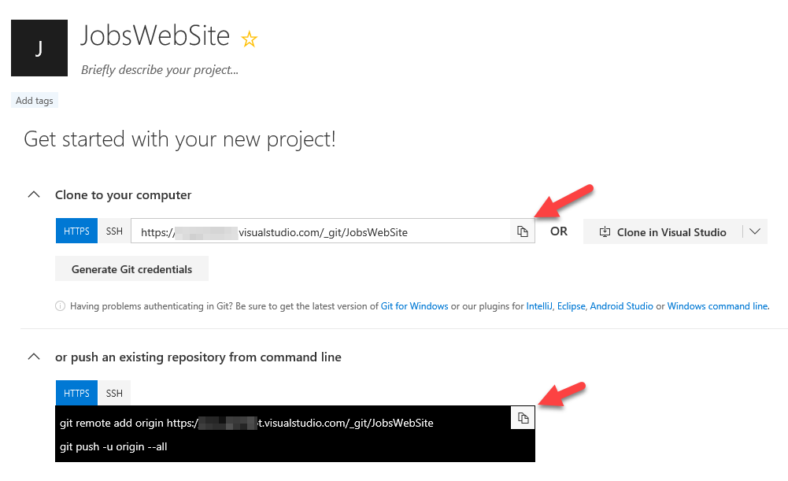

1. We now need to push the web site code to remote repo. On your DEV VM open `PowerShell` and navigate to your folder that has the Web Site Project. If prompted to login, use you Visual Studio Online credentials.

    ```powershell
    cd c:\sourceapps\jobswebsite\
    git init
    git remote add origin https://<your tenant>.visualstudio.com/_git/JobsWebSite
    git add *
    git commit -m "initial commit"
    git push --set-upstream origin master
    ```

1. Browse to the VSTS Portal and click `Code` in the navigation, you should see the files in the repo

    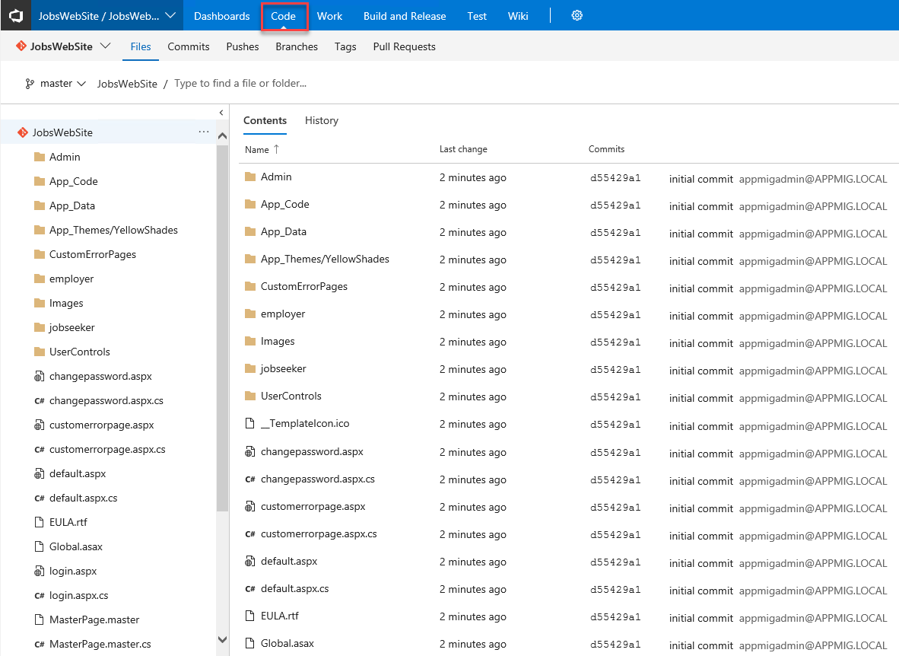

1. Now that we have our source files in VSTS, we can create a Build Definition. Click on `Build and Release` > `New definition`

    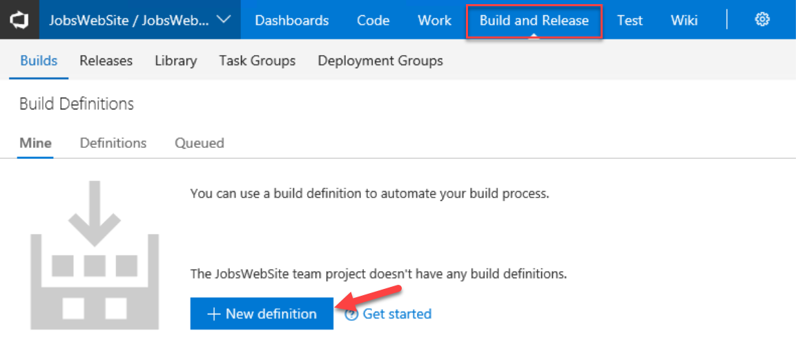

1. Select the VSTS Git Repo you just created and click `Continue`

    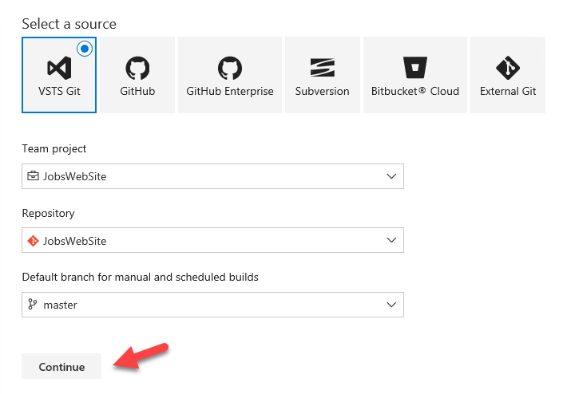

1. Click `Empty Process`

    

1. In the Tasks menu click the `+` symbol. Enter `archive` in the search > select the `Archive Files` task

    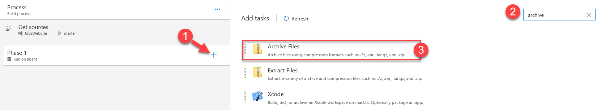

1. In the Tasks click the `+` symbol > enter `publish artifact` > select the `Publish Build Artifacts` task

    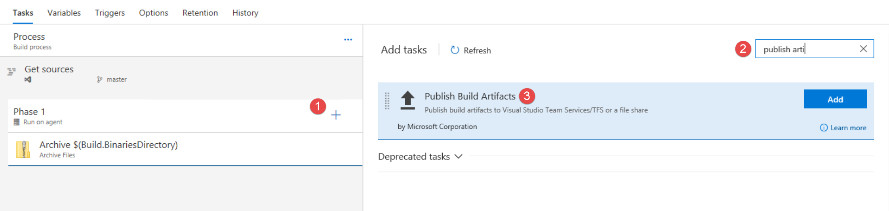

1. Select the `Publish Artifact` task

1. In the `Path to publish`, enter `$(Build.ArtifactStagingDirectory)`

1. Enter `drop` in the and Artifact name

1. Select `Visual Studio Team Service/TFS` for the Artifact publish location

    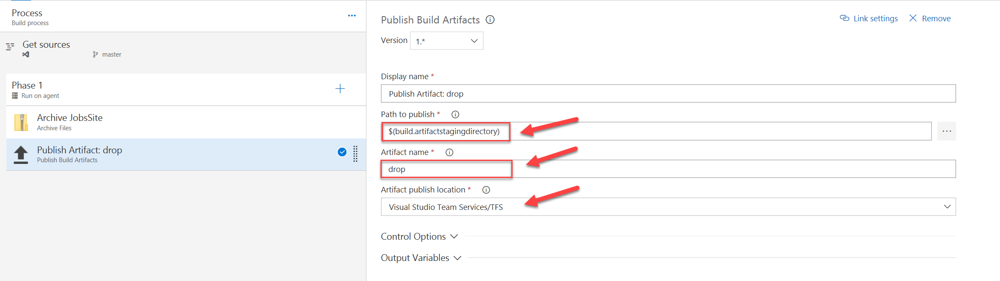

1. Click on `Triggers` and enable continuous integration

    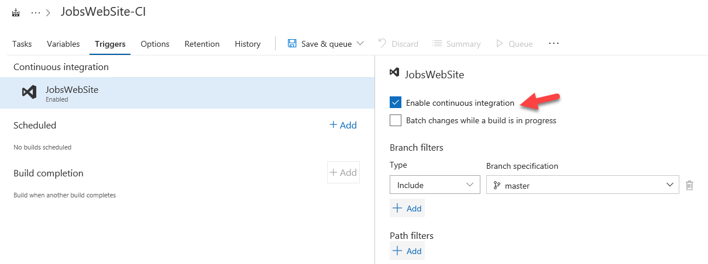

1. Click `Save and Queue` and you should see a new Build

    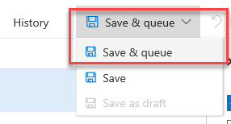

1. Click on the Build # and you can verify in the Log that the Archive of the job site did indeed happen

    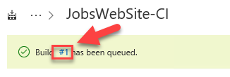

1. Now that we have our source files, we can create a Release Definition to deploy our site

1. In the VSTS Portal now click `Releases > + New definition`

    

1. Choose `Azure App Service` Deployment

    

1. Select the phase and task for the environment you just created

    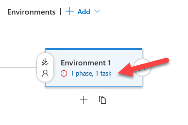

1. We need to provide Visual Studio Online access to manage resources in your Azure subscription. This is done by authorizing to the subscription or creating a new `Service Endpoint`.

    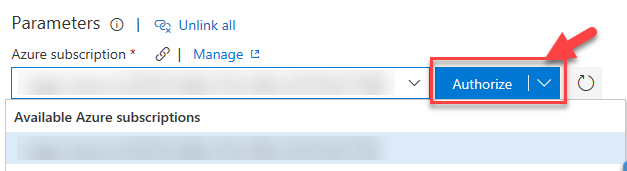

    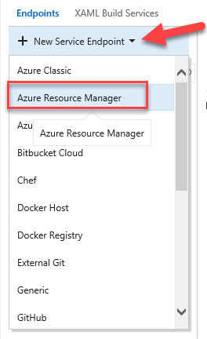

1. Select your subscription from the list. If it is not listed, follow the directions to `use the full version...` to register the Azure endpoint

    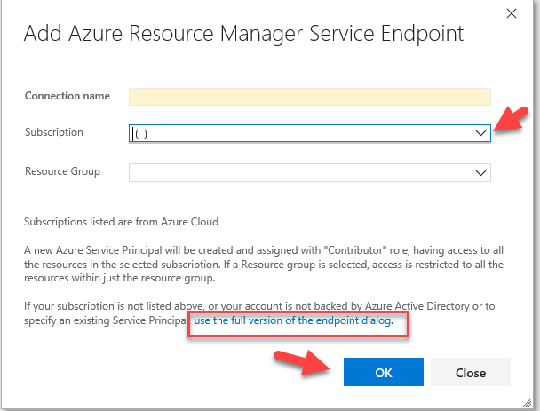

1. Once you subscription is authorized, set the App type to `Web App` > Choose the 'jobswebsite[YOUR CUSTOM NAME]' > Validate that the Package or folder is set to `$(System.DefaultWorkingDirectory/**/*.zip)` and click 'Save'

    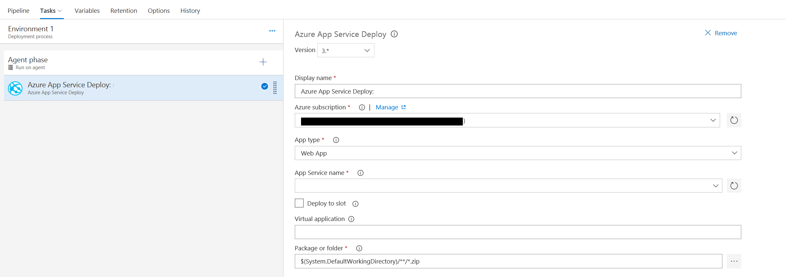

1. On the Release Pipeline click on `+ Add` next Artifacts

    

1. Select the Build definition from the previous steps

    

1. Click `Save` to save the configuration. Then click `Release >  Create Release`

    

1. You should now see the release 'IN PROGRESS'

    

1. Click on Log to verify the release was successful

    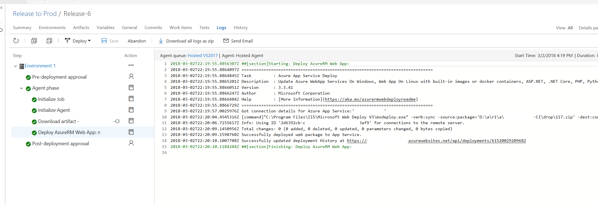

---

## Summary

In this hands-on lab, you learned how to:

* Migrate a database to Azure SQL PAAS using Azure SQL Migrate
* Create VS 2017 empty project
* Copy files from source apps
* Add to VSTS
* Create pipeline and deploy to the PAAS app service
* Update the connection string in the APP Settings of the app service

---
Copyright 2016 Microsoft Corporation. All rights reserved. Except where otherwise noted, these materials are licensed under the terms of the MIT License. You may use them according to the license as is most appropriate for your project. The terms of this license can be found at [https://opensource.org/licenses/MIT](https://opensource.org/licenses/MIT).