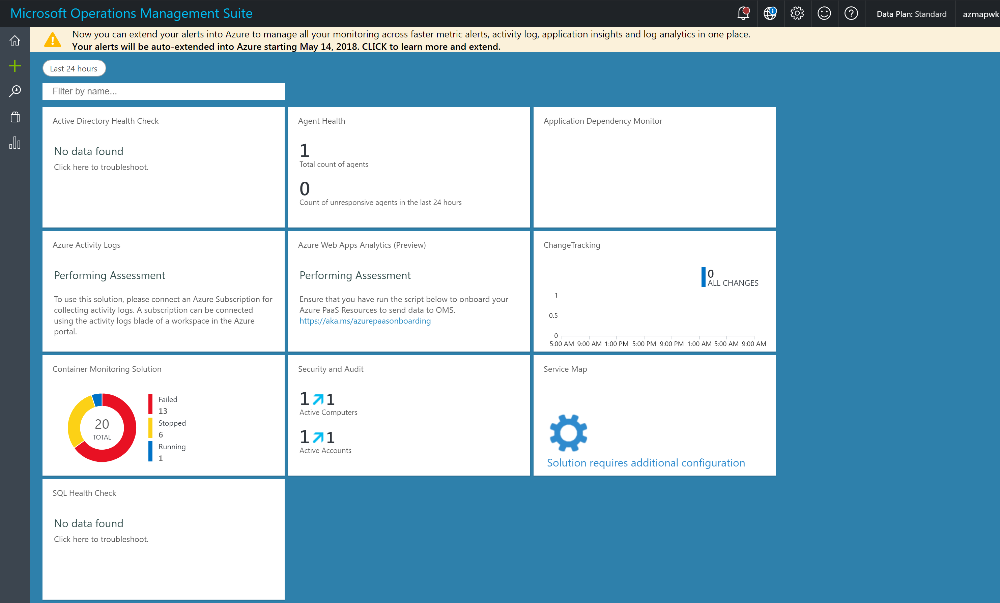
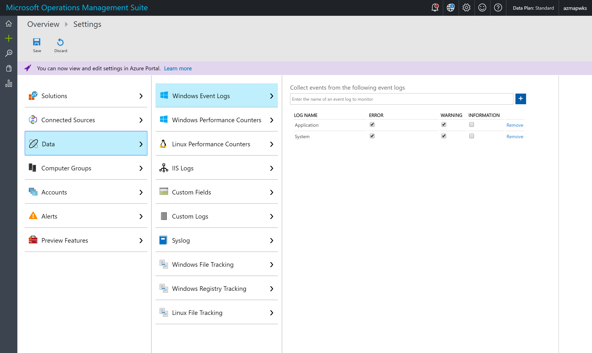
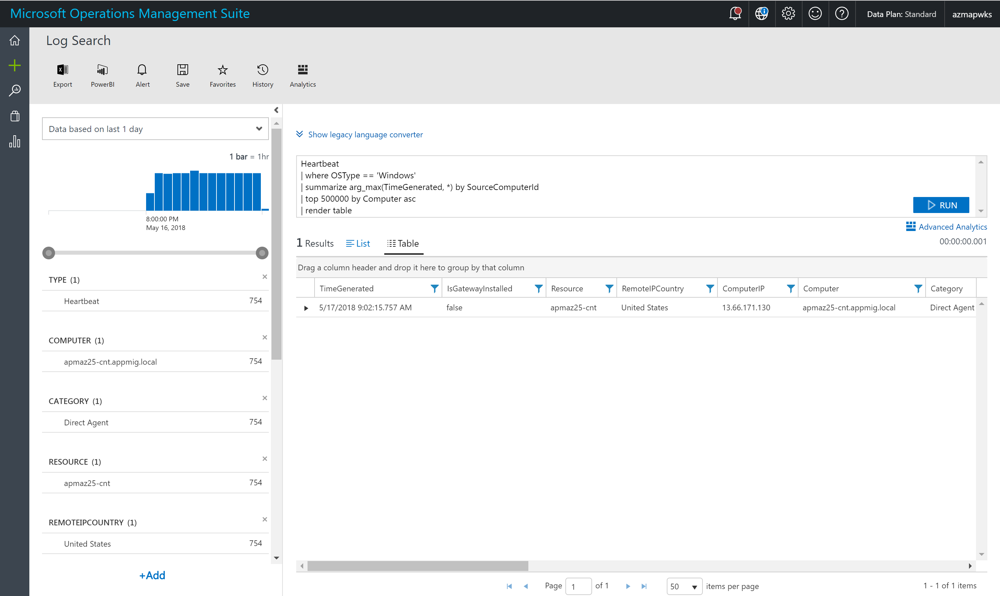
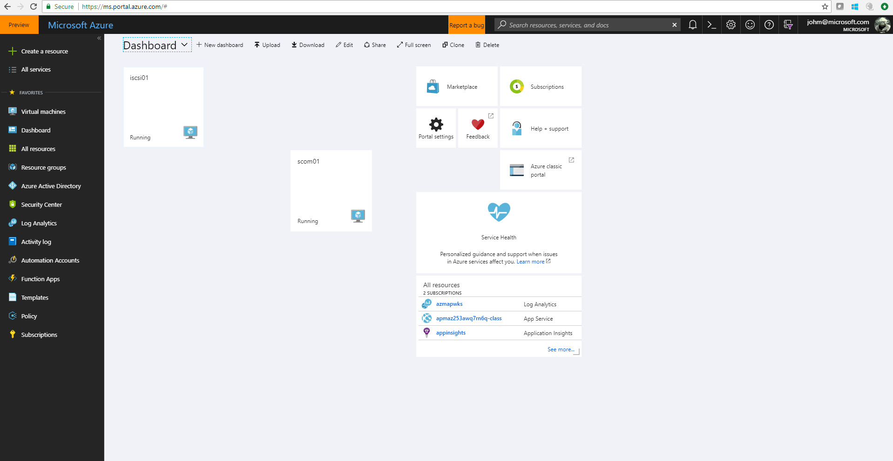
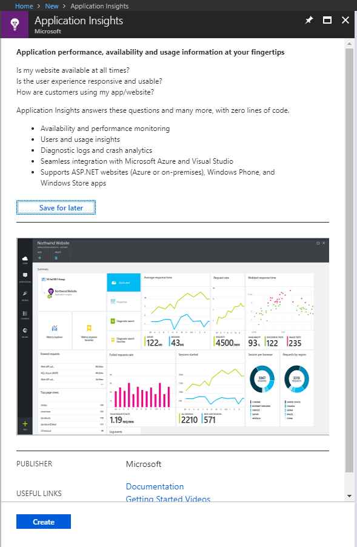
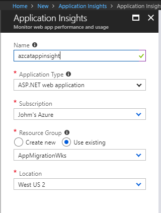
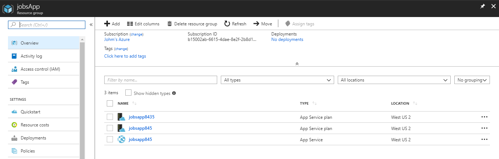
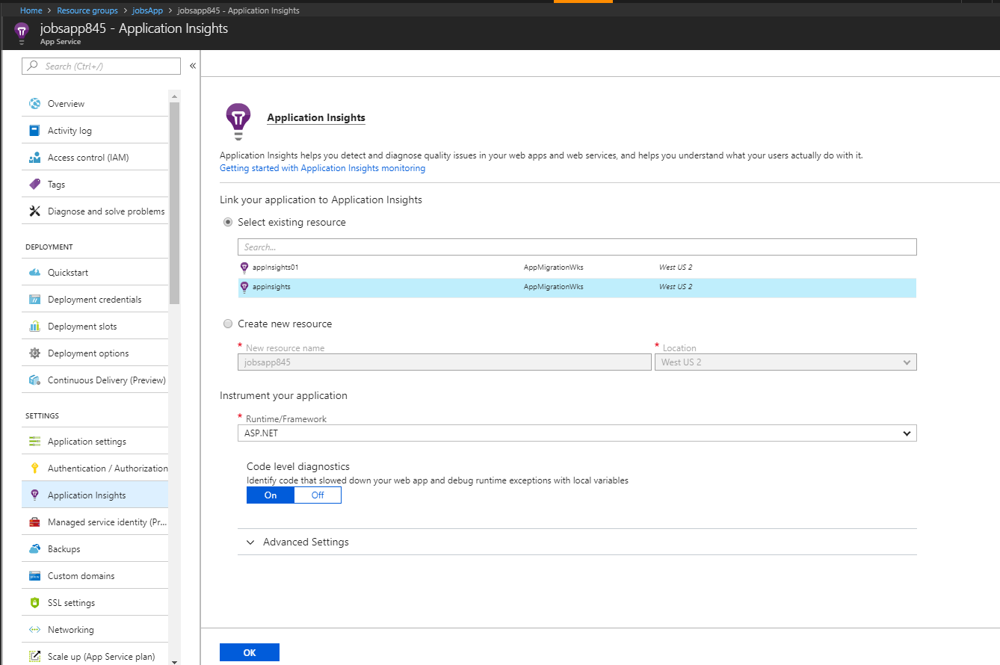
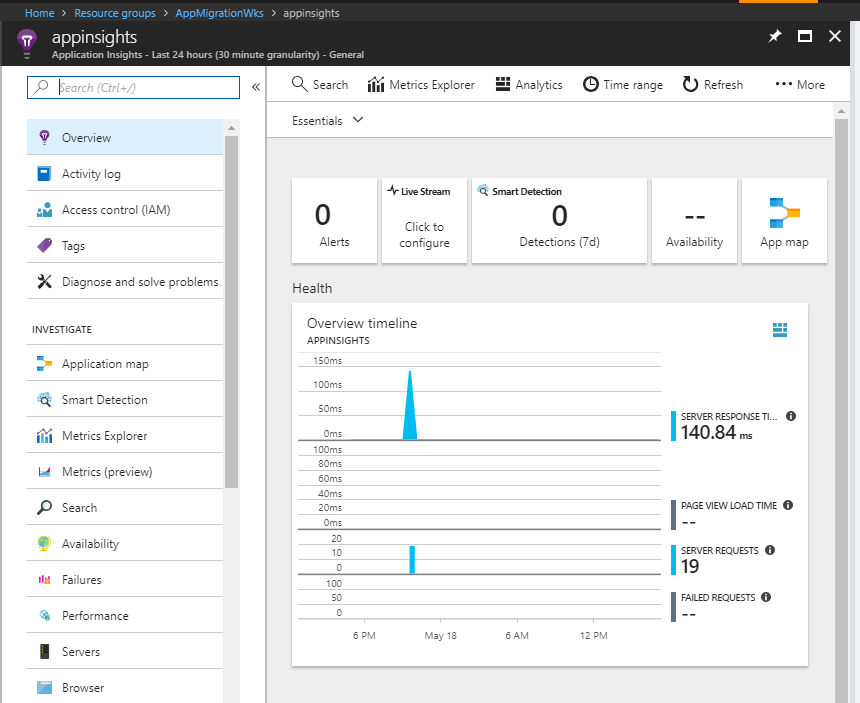

# Monitoring your new environment

## Overview

In this lab you will learn how to monitor the environment using Azure services

## Prerequisites

Ensure you have completed the previous HOLs

## Excercies

1. [Exercise 1: Deploy Log Analytics](#ex1)
1. [Exercise 2: Enable Agents for Log Analytics](#ex2)
1. [Exercise 3: Configure Performance Counters and Event Log Collection](#ex3)
1. [Exercise 4: Enable PaaS services to send data to log analytics](#ex4)
1. [Exercise 5: Validate the deployment](#ex5)
1. [Exercise 6: Deploy Application Insights](#ex6)


WebApp/IIS
https://docs.microsoft.com/en-us/azure/log-analytics/log-analytics-data-sources-iis-logs

AppInsights level
https://docs.microsoft.com/en-us/azure/application-insights/app-insights-monitor-performance-live-website-now

//windows containers - web
//PaaS - web/database
//Hybrid/IaaS - database

### Exercise 1: Deploy Log Analytics<a name="ex1"></a>
1. Login to https://shell.azure.com
    ```powershell
    Select-AzureRmSubscription -Subscription "<your subscription name>"
    ```
1. Change the variables for the following PowerShell code and copy and paste into the shell window
	```powershell
	#set your variables
	$Location = "<log analytics region>"
	$WorkspaceName = "<globally unique name for workspace">
	$ResourceGroup = "<resource group name>"
	$solutions = "Security","SQLAssessment","AgentHealthAssessment", "ChangeTracking", "LogManagement","ADAssessment","Containers","ContainerInsights","AzureWebAppsAnalytics","ServiceMap","AppDependencyMonitor","AzureActivity"

	# Create the workspace
	New-AzureRmOperationalInsightsWorkspace -Location $Location -Name $WorkspaceName -Sku Standard -ResourceGroupName $ResourceGroup

	#add solutions
	foreach ($solution in $Solutions) 
	{
		Set-AzureRmOperationalInsightsIntelligencePack -ResourceGroupName $resourcegroup  -WorkspaceName $WorkspaceName -IntelligencePackName $solution -Enabled $true
	}
	```

### Exercise 2: Enable Agents for Log Analytics<a name="ex2"></a>
1. Run the following PowerShell code to enable the Microsoft Monitoring agent and binding it to the newly created workspace. This process will take a few minutes as it will uninstalled the Monitoring Extension and ReInstall and register it
	```powershell
	#get log analytics workspace 
	$loganalyticswks = (Get-AzureRMOperationalInsightsWorkspace -ResourceGroupName $resourcegroup -name $workspacename).customerid.guid

	#get log analytics workspace key
	$workspacekey = (Get-AzureRMOperationalInsightsWorkspaceSharedKeys -ResourceGroupname $resourcegroup -name $workspacename).primarysharedkey
	$allVMs = Get-AzureRMVM -resourcegroupname $resourcegroup

	foreach($vm in $allvms)
	{

		Remove-AzureRMVMExtension -ResourceGroupName $resourcegroup -VMName $vm.name -name Microsoft.EnterpriseCloud.Monitoring -force
		Set-AzureRMVMExtension -ResourceGroupName $resourcegroup -VMName $vm.name -Name 'MicrosoftMonitoringAgent' -Publisher 'Microsoft.EnterpriseCloud.Monitoring' -ExtensionType 'MicrosoftMonitoringAgent' -TypeHandlerVersion '1.0' -Location $vm.location -SettingString "{'workspaceId':  '$loganalyticswks'}" -ProtectedSettingString "{'workspaceKey': '$workspaceKey' }"
	}
	```
### Exercise 3: Configure Performance Counters and Event Log Collection<a name="ex3"></a>
1. Run the following PowerShell code to collect the Application and System logs from all the windows machines
	```powershell
	#Collect Sample Events Logs for System and Application
	New-AzureRmOperationalInsightsWindowsEventDataSource -ResourceGroupName $ResourceGroup -WorkspaceName $WorkspaceName -EventLogName "Application" -CollectErrors -CollectWarnings -Name "Application Event Log"
    New-AzureRmOperationalInsightsWindowsEventDataSource -ResourceGroupName $ResourceGroup -WorkspaceName $WorkspaceName -EventLogName "System" -CollectErrors -CollectWarnings -Name "System Event Log"
	```
1. Run the following PowerShell code to collect some base performance counters for windows
	```powershell
	#creating a performance counter hashtable
	$Performancecounters = [ordered]@{
        LogicalDiskFS = "LogicalDisk-'% Free Space'";
		LogicalDiskADsR = "LogicalDisk-'Avg. Disk sec/Read'";
		LogicalDiskADsW = "LogicalDisk-'Avg. Disk sec/Write'";
		LogicalDiskCDQL = "LogicalDisk-'Current Disk Queue Length'";
		LogicalDiskDRs = "LogicalDisk-'Disk Reads/sec'";
		LogicalDiskDTs = "LogicalDisk-'Disk Transfers/sec'";
		LogicalDiskDWt = "LogicalDisk-'Disk Writes/sec'";
		LogicalDiskDFreeMB = "LogicalDisk-'Free Megabytes'";
        MemoryCBiU = "Memory-'% Committed Bytes In Use'";
        MemoryAbytes = "Memory-'Available MBytes'";
		NetworkAdapterBR = "'Network Adapter'-'Bytes Received/sec'";
		NetworkAdapterBs = "'Network Adapter'-'Bytes Sent/sec'";
		NetworkInterfaceBTs = "'Network Interface'-'Bytes Total/sec'";
        ProcessorPT = "'Processor'-'% Processor Time'";
        SystemPWL = "'System'-'Processor Queue Length'";
         }

	$Performancecounters.keys |foreach-object{
    $Name = $_
    $ObjectName = $Performancecounters[$_].split('-')[0]
    $CounterName = $Performancecounters[$_].split('-')[1]
    New-AzureRmOperationalInsightsWindowsPerformanceCounterDataSource -ResourceGroupName $resourcegroup -WorkspaceName $workspacename -Name $Name -Objectname $objectName -CounterName $Countername
	}
	```
### Exercise 4: Enable PaaS services to send data to log analytics<a name=ex4></a>
1. Run the following commands to enable Azure Diagnostics framework to send to Log analytics
	```powershell
	#enumerates all resources in the resource group we deployed
	$resources = get-azurermresource -resourcegroupname $resourcegroup

	$workspaceid = (Get-AzureRmOperationalInsightsWorkspace -ResourceGroupName $resourcegroup).resourceid
	#cycles true the resources and enables the diagnostics extension
	foreach($resource in $resources)
	{
		$diag = get-azurermdiagnosticsetting -resourceid $resource.resourceid |out-null
		if($?)
		{
			write-host $resource.resourceid
			set-azurermdiagnosticsetting -resourceid $resource.resourceid -workspaceid $workspaceid -enabled $true 
		}
	}
	```
	
### Exercise 5: Validate the Log Analytics Deployment<a name=ex5></a>
1. Run the following PowerShell to obtain the log analytics portal url
	```powershell
	Get-AzureRMOperationalInsightsWorkspace -ResourceGroupName $resourcegroup -name $workspacename
	```
1. The output will include the Portal url, an output example is listed below
	```powershell
	Name              : azmapwks
	ResourceGroupName : appmigrationwks
	ResourceId        : /subscriptions/b15002ab-6615-4dae-8e2f-2b8d1a41cfc0/resourcegroups/appmigrationwks/providers/microsoft.operationalinsights/workspaces/azmapwks
	Location          : eastus
	Tags              : {}
	Sku               : standard
	CustomerId        : eaab82e2-859d-4d5b-b3f8-8ede8dbd97af
	PortalUrl         : https://eus.mms.microsoft.com/Account?tenant=72f988bf-86f1-41af-91ab-2d7cd011db47&resource=%2fsubscriptions%2fb15002ab-6615-4dae-8e2f-2b8d1a41cfc0%2fresourcegroups%2fappmigrationw
                    ks%2fproviders%2fmicrosoft.operationalinsights%2fworkspaces%2fazmapwks
	ProvisioningState : Succeeded
	```
1. Copy the PortalURL and open in browser. Logon with your Azure Credentials (if prompted) and if you have multiple workspaces choose the subscription and workspace name you have created in the previous steps
1. The main dashboard should appear as show in the image. This is your basic dashboard with your imported solutions from the previous steps. In the top right hand corner, you will see a gear icon, click it to go into the settings
	
1. In the settings click into Data --> Event Logs and observe that the previous event logs we have add are here. In the field "Enter the name of the event log to monitor" enter the name of an event log you are interested to collect for demo purposes.
	
1. Click into Data --> Windows Performance Counters and validate the counters which we previously created are listed. Again add more counters by typing the name into the "Enter the name of a performance counter to monitor" box 
1. Click on Connected Sources and Click Windows Servers. We should have a number of Windows Servers Connected, You can click on the X Windows Computer Connected and it will transport you to the log analytics search engine. First though observe the workspace ID and the workspace keys. If you want to do a manual install at a later date, you will need this information. Click on the X Windows Computer Connected
	
1. Reveiw the search portal and the query window. Remove the query and it will drop a list of options for you to begin constructing your own query. Dont get hung up on this yet. Return to the main dashboard by pressing the home button in the top left hand corner.
1. Review each solution deployed and the data collected. Drill into each dashboard and it will drive you back to the original query used to create the dashboard.

### Exercise 6 Deploy Application Insights <a name=ex6></a>
1. Open http://portal.azure.com
1. In the top left hand corner, click Create a Resource
	
1. In the "Search the Marketplace" type "Application Insights" and press enter
1. Click Create on the bottom of the Application Insights Blade
	
1. Populate the fields as follows
	```
	Name: appInsights
	Application Type: ASP.NET web application
	Subscription: <select the subscription you have deployed into previously>
	Resource Group: <select the app migration resource group>
	Location: <use the default>
	```
	Click Create to deploy the Application Insights Resource

	>
	
1. On the left hand menu, Click Resource Groups
1. Click the jobsApp resource group 
	>`NOTE: the name of the resource group may vary in your deployment choose where you deployed the jobsapp in previous labs`
1. Locate the App Service use the type column to identify the resource. The App Service name is generated at deployment time. Click the App Service

1. In the left hand menu for the App Service, click Application Insights
1. Click Select Existing Resource and Select the Application Insights Resource you created in the previous steps. Click Ok to complete and Click Continue to verify. 

1. In the left hand menu, click Resource Groups and Click the Application Migration Workshop Resource group (the name will vary based on your deployment)
1. Locate the Application Insights Resource previously created and Click
1. In the Overview window click Live Stream

1. In a second windows open the URL to the JobsApp, click F5 repeatidly to simulate web traffic 
1. Navigate between both windows for the live stream and refresh the page for jobs app to simulate web traffic
1. Repeat the steps for other app services deployed in the subscription to tie to the application insights resource and navigate to the web pages to simulate traffic


---


## Summary

In this hands-on lab, you learned how to:

* Set up monitoring using Azure services

---

Copyright 2016 Microsoft Corporation. All rights reserved. Except where otherwise noted, these materials are licensed under the terms of the MIT License. You may use them according to the license as is most appropriate for your project. The terms of this license can be found at https://opensource.org/licenses/MIT.
